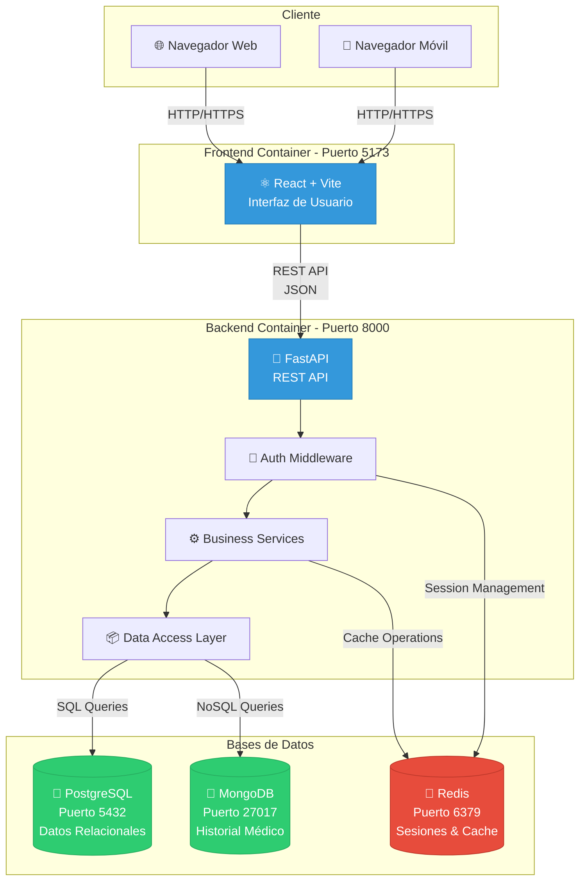
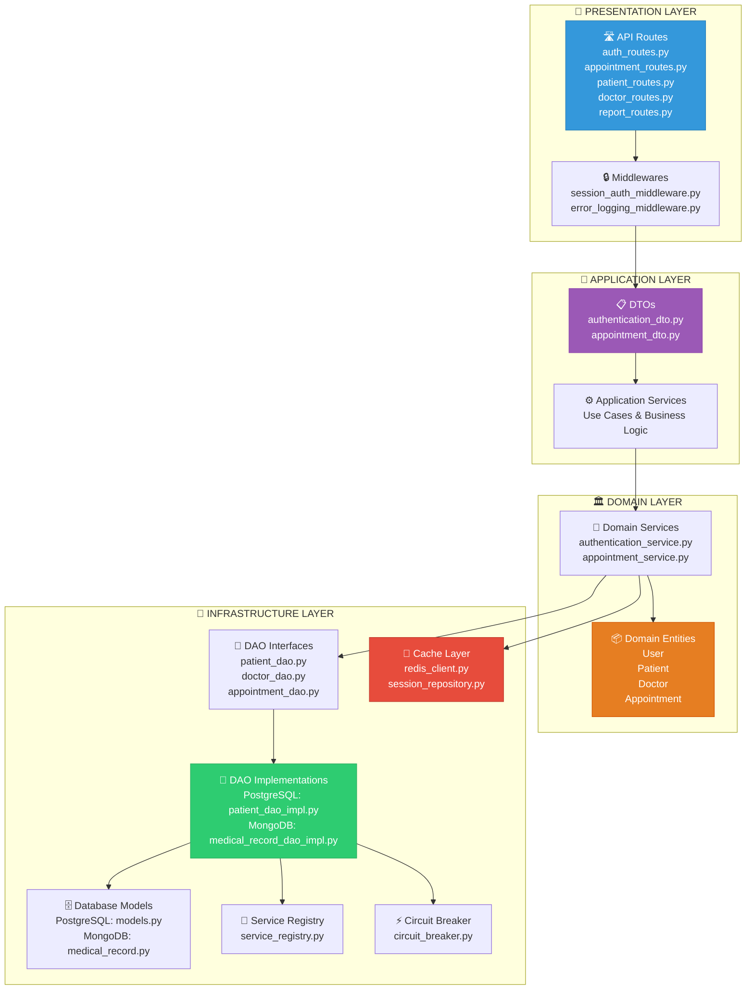
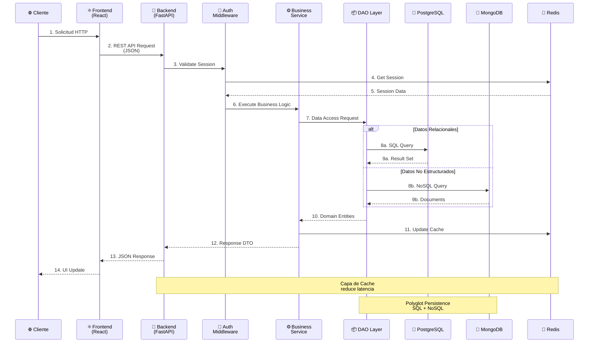
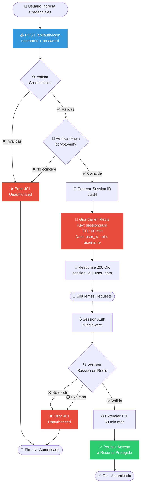
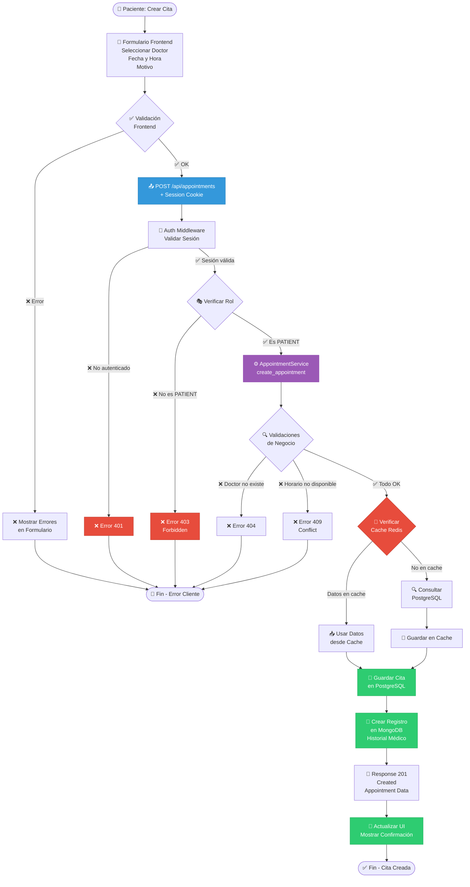
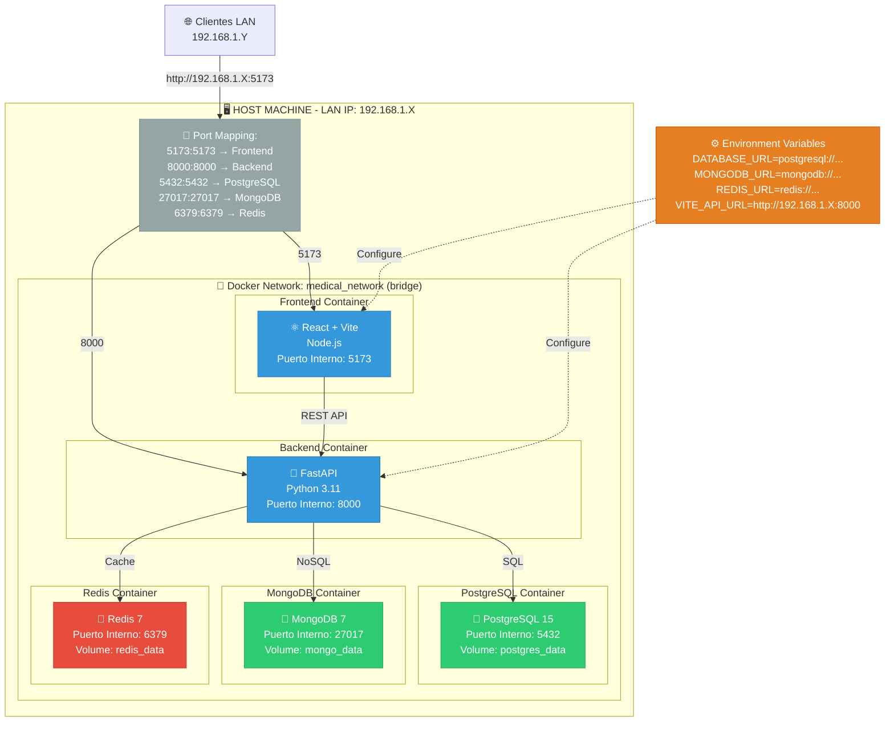
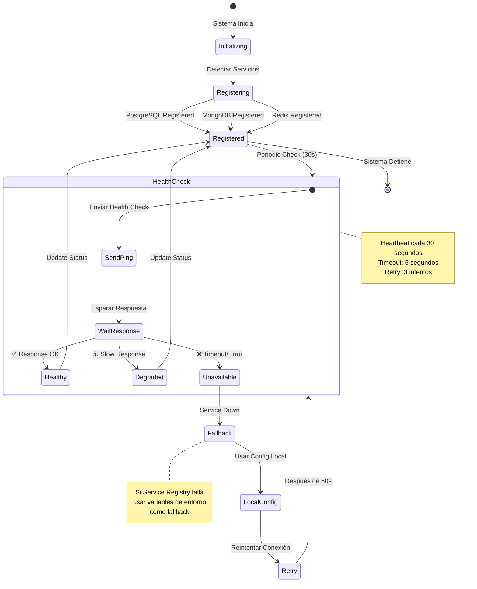
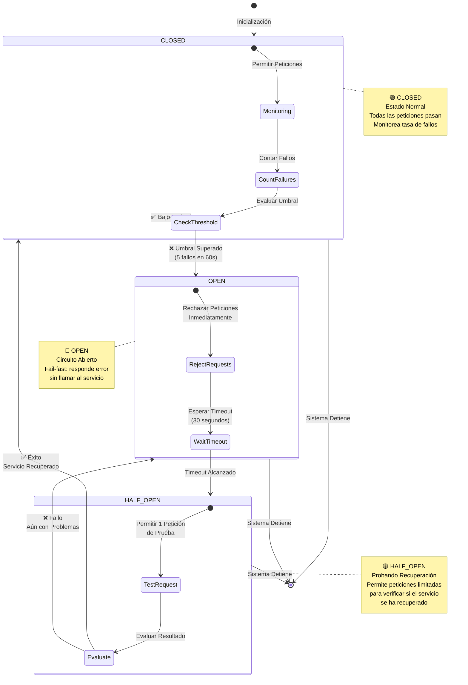
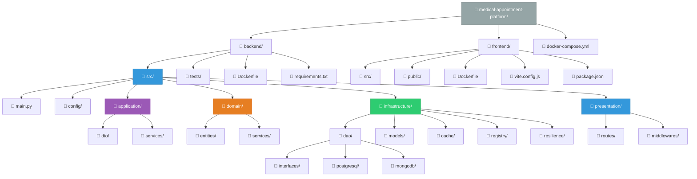

# 📊 DIAGRAMAS DE ARQUITECTURA - SISTEMA DE CITAS MÉDICAS

---

## 1️⃣ DIAGRAMA DE ARQUITECTURA GENERAL

**Descripción:**
Este diagrama muestra la arquitectura general del sistema con tres capas principales: Cliente (navegadores), Frontend (React), Backend (FastAPI) y capa de persistencia (PostgreSQL, MongoDB, Redis).

---

## 2️⃣ DIAGRAMA DE ARQUITECTURA DE CAPAS

**Descripción:**
Arquitectura en capas mostrando la separación de responsabilidades: Presentación (HTTP), Aplicación (casos de uso), Dominio (lógica de negocio) e Infraestructura (persistencia).

---

## 3️⃣ DIAGRAMA DE COMUNICACIÓN ENTRE COMPONENTES

**Descripción:**
Flujo secuencial de una petición típica mostrando la interacción entre todos los componentes del sistema, desde el cliente hasta las bases de datos.

---

## 4️⃣ DIAGRAMA DE PATRONES DE DISEÑO

```mermaid
graph TB
    subgraph "📐 DAO PATTERN"
        IDAO["<<interface>><br/>PatientDAO"]
        PGDAO["PatientDAOImpl<br/>(PostgreSQL)"]
        
        IDAO -.implements.-> PGDAO
    end

    subgraph "📋 DTO PATTERN"
        REQUEST["LoginRequestDTO<br/>- username<br/>- password"]
        RESPONSE["LoginResponseDTO<br/>- session_id<br/>- user_data"]
        ENTITY["User Entity<br/>(Domain)"]
        
        REQUEST -->|transform| ENTITY
        ENTITY -->|transform| RESPONSE
    end

    subgraph "📡 SERVICE REGISTRY"
        REGISTRY["ServiceRegistry<br/>- register_service()<br/>- discover_service()<br/>- health_check()"]
        PG_SERVICE["PostgreSQL<br/>Service"]
        MONGO_SERVICE["MongoDB<br/>Service"]
        REDIS_SERVICE["Redis<br/>Service"]
        
        PG_SERVICE -->|register| REGISTRY
        MONGO_SERVICE -->|register| REGISTRY
        REDIS_SERVICE -->|register| REGISTRY
    end

    subgraph "⚡ CIRCUIT BREAKER"
        CB["CircuitBreaker<br/>States: CLOSED, OPEN, HALF_OPEN"]
        SERVICE_CALL["Service Call"]
        
        SERVICE_CALL -->|protected by| CB
    end

    subgraph "💉 DEPENDENCY INJECTION"
        FASTAPI["FastAPI Depends()"]
        DB_SESSION["get_db_session()"]
        AUTH_USER["get_current_user()"]
        
        FASTAPI -->|inject| DB_SESSION
        FASTAPI -->|inject| AUTH_USER
    end

    style IDAO fill:#9b59b6,stroke:#8e44ad,color:#fff
    style REQUEST fill:#9b59b6,stroke:#8e44ad,color:#fff
    style REGISTRY fill:#e67e22,stroke:#d35400,color:#fff
    style CB fill:#e74c3c,stroke:#c0392b,color:#fff
    style FASTAPI fill:#3498db,stroke:#2980b9,color:#fff
```

**Descripción:**
Visualización de los 5 patrones de diseño principales implementados: DAO, DTO, Service Registry, Circuit Breaker y Dependency Injection.

---

## 5️⃣ DIAGRAMA DE FLUJO DE AUTENTICACIÓN

**Descripción:**
Flujo completo de autenticación mostrando login inicial, creación de sesión en Redis y validación en requests subsecuentes mediante middleware.

---

## 6️⃣ DIAGRAMA DE FLUJO DE CREACIÓN DE CITA

**Descripción:**
Flujo detallado de creación de cita médica incluyendo validaciones frontend/backend, verificación de roles, cache con Redis y persistencia en PostgreSQL + MongoDB.

---

## 7️⃣ DIAGRAMA DE DESPLIEGUE DOCKER

**Descripción:**
Arquitectura de despliegue mostrando los 5 contenedores Docker, red bridge, mapeo de puertos, volúmenes persistentes y configuración para LAN.

---

## 8️⃣ DIAGRAMA DE SERVICE REGISTRY

**Descripción:**
Máquina de estados del Service Registry mostrando registro de servicios, health checks periódicos, manejo de degradación y fallback a configuración local.

---

## 9️⃣ DIAGRAMA DE CIRCUIT BREAKER

**Descripción:**
Estados del Circuit Breaker (CLOSED, OPEN, HALF_OPEN) con umbrales configurables para proteger contra fallos en cascada.

---

## 🔟 DIAGRAMA DE ESTRUCTURA DE DIRECTORIOS

**Descripción:**
Estructura completa del proyecto mostrando organización de carpetas backend (arquitectura en capas) y frontend, con énfasis en separación de responsabilidades.

---

## 📊 RESUMEN DE DIAGRAMAS

| # | Diagrama | Propósito | Audiencia |
|---|----------|-----------|-----------|
| 1 | Arquitectura General | Vista de alto nivel del sistema completo | Todos |
| 2 | Arquitectura de Capas | Separación lógica del código | Desarrolladores |
| 3 | Comunicación | Flujo de datos entre componentes | Arquitectos |
| 4 | Patrones de Diseño | Patrones implementados | Desarrolladores Senior |
| 5 | Flujo Autenticación | Proceso de login y sesiones | Seguridad/DevOps |
| 6 | Flujo Creación Cita | Caso de uso principal | Product Owners |
| 7 | Despliegue Docker | Infraestructura y networking | DevOps |
| 8 | Service Registry | Descubrimiento de servicios | Arquitectos |
| 9 | Circuit Breaker | Resiliencia del sistema | SRE/DevOps |
| 10 | Estructura Directorios | Organización del código | Desarrolladores |

---

**Fecha de Generación:** Febrero 2026  
**Autores:** Aucancela Andrés, Ponce Joseph, Villareal Jhonatan  
**Versión:** 1.0